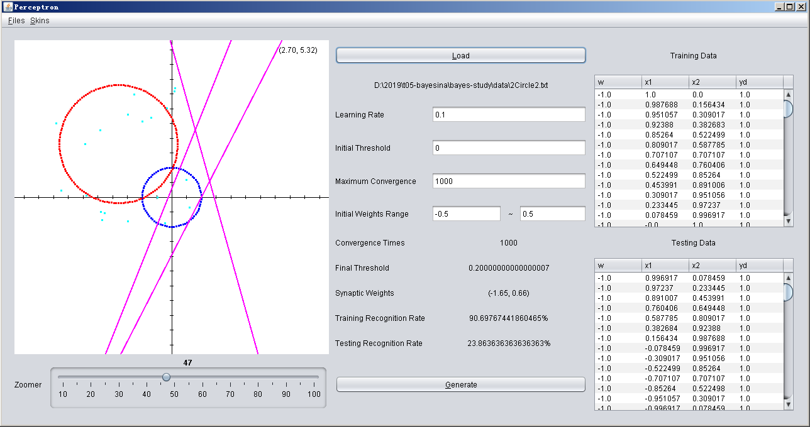
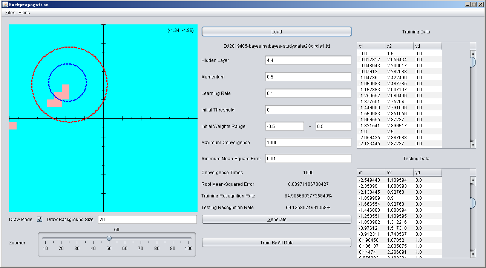

# 基础示例

## 概述

统计学和神经网络的一些最基础的示例。

## 目录

- 统计
    * 贝叶斯
    * 隐马尔科夫模型
        * 维特比算法
- 神经网络
    * 感知器
    * 回馈神经网络
    
## 运行环境

- JDK8+

## 截图

感知器（参考: https://github.com/Jasonnor/Perceptron): 

反馈神经网络(参考: https://github.com/Jasonnor/Backpropagation):

